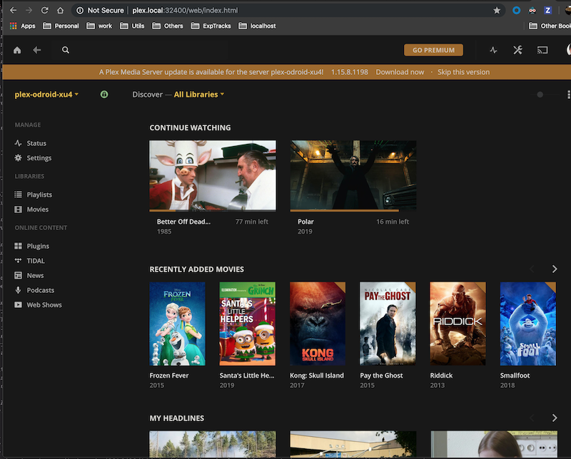
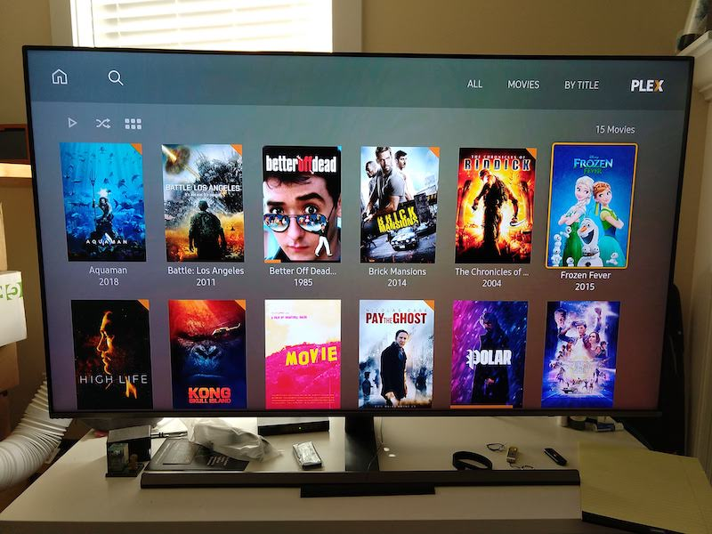

## Hometertain




### System overview
Home entertainment center host on an odroid-x3/4
- Hardware: Odroid xu3/4, OS: ubuntu minimal 18.04
- Plex server housing media files
- Torrent service (transmission-daemon on ubuntu); Another machine (e.g. mac) used Transmission Remote GUI to manage torrent downloads remotely (within LAN network).
- Open VPN service running Private Internet Access (paid subscription) 
- Movies streamed on plex clients such as mobile phone, smart tv or another computer.

## Build Step
### Install OS
Download img.xz from [here](https://odroid.in). This instruction uses ubuntu 18.04 minimal (headless). Plug eMMC/SD card 
to adapter, then adapter -> workstation

Obtain list of current mounting devices
```bash
diskutil list
```

Decompress xz to img
```bash
$ xz -d /path/to/ubuntu-image.xz
# this will generate ubuntu-image.img
```

diskutil check again to obtain the correct path to eMMC module
```bash
diskutil list
```

Unmount eMMC path, and flash OS img to it
```bash
diskutil unmountdisk /dev/diskX
sudo dd of=/dev/diskX bs=1m if=/path/to/ubuntu-image.img
# waiting..
```

Unmount it again
```bash
diskutil unmountdisk /dev/diskX
```

Now you can plug it to the droid/raspberry-pi. 
- If this is an xu3 board, DO NOT use USB 3.0 dongle gigabit internet. It was just cumbersome trying to get this work.
- Turn on the board. Default login is root/odroid.

### Setup OS and software
Run as root user:
```bash
./apts-update.sh
# setup with hostname='plexie'. Change it to whatever name you want.
./setup.sh 'plexie'
```

After restart, login as `odroid` user. If `cmyip` doesn't work, fix it manually:
```bash
pip install --user BeautifulSoup4
pip install --user requests
```

### Transmission Client
Transmission client is installed on a client PC to interact with torrent server. This instruction applies to mac:
```bash
ruby -e "$(curl -fsSL https://raw.githubusercontent.com/Homebrew/install/master/install)" < /dev/null 2> /dev/null ; brew install caskroom/cask/brew-cask 2> /dev/null
brew cask install transmission-remote-gui
# Source http://macappstore.org/transmission-remote-gui/
``` 
Connect to torrent server using IP, default port 9091, default auth odroid/odroid

### Plex client & TV setup
- From a client machine (workstation, mobile, etc), open browser and navigate to `http://${plex-server-id}:32400/web/index.html`. 
Proceed with normal setup to onboard this new server. When adding libraries, choose `/home/odroid/plex/` 
- All plex servers on LAN network should show up now
- Now open/restart your TV, you'll see your new server

### Enjoy!

## Developer
* To manually stop using VPN, stop `openvpn@default` service 
    ```bash
    sudo service openvpn@default stop
    sudo service openvpn@default start
    ```